# Scaled 2-Input CMOS Nand Gate using 28nm Technology

Here we have designed a Scaled-2 Input CMOS NAND Gate using the 28nm Process Design Kit available on Synopsys Custom Compiler and analyzed the output and delay in comparison to a Conventional CMOS NAND Gate using the PrimeWave Design Environment.

# Abstract

Nowadays, we observe that a complementary-metaloxide-semiconductor (CMOS) is widely used in large scale integrated circuits. Here we aim to design a scaled 2-input CMOS NAND Gate on a 28nm scale and analyze its output behavior along with the delay analysis for the same in comparison to a conventional 2-input CMOS NAND Gate. NAND gates are basic universal gates because with the help of these gates, we can create any digital circuit. Most of the CMOS Nand gate design techniques need either a p-logic block or an n-logic block for evaluation of input and output behavior at a transistor level.

# Contents

* [Introduction](#Introduction)
* [Conventional NAND Gate](#Conventional-NAND-Gate)
* [Scaled NAND Gate](#Scaled-Nand-Gate)
* [Tools Used](#Tools-Used)
* [Circuit Design](#Circuit-Design)
* [Simulation](#Simulation)
* [SPICE Netlist](#SPICE-Netlist)
* [Delay Comparison](#Delay-Comparison)
* [Conclusion](#Conclusion)
* [Author](#Author)
* [Acknowledgements](#Acknowledgements)
* [References](#References)

# Introduction

In the world of Digital Circuits, NAND gates are one of the most prominent logic gates which produce a low output only when all of the inputs are high(i.e. logic 1).The output of these gates is simply the invert/complement of an AND gate. They are one of the two Universal gates(the other being NOR gates) but are more common in the industry than the latter, the reason for this being the Design Implementation easeness and the less complex approach of minterms involved in NAND Gate logic. The recent changes in the VLSI Industry in view of the shrinking size of transistors has changed the way these devices impact the world. The CMOS NAND Gates are widely used in a lot of digital, analog and mixed signal circuits.
In CMOS technology, both N-type and P-type transistors are used to design logic functions. The same signal which turns ON a transistor of one type is used to turn OFF a transistor of the other type. This characteristic is the root reason allowing us to design our Conventional and Scaled NAND logic.
The work that was done using the 28nm Library file in this design is divided into three sections-
1) Design of Conventional NAND gate
2) Design of Scaled NAND gate
3) Delay comparison

# Conventional NAND Gate
## Reference Circuit

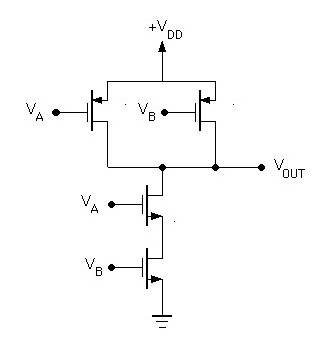 
Fig: Reference Circuit of Conventional NAND Gate 

## Design Explanation
### Truth Table

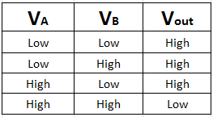 
Fig: Truth Table of NAND Gate 

As it is visible in the reference circuit above, the 2-input CMOS NAND Gate is made by connecting two PMOS transistors in parallel which in turn are connected in series with the two NMOS transistors which again are in series connection with each other. The two inputs Va and Vb are given in such a way that the Va input line is given simultaneously to the gate of left PMOS and upper NMOS whereas the input line Vb is given simultaneously to the gate of right PMOS and lower NMOS. The source of the PMOS transistors are given directly to the Vdd and the Vout terminal is observed to get our desired output.

So now considering the truth table above,

Case 1: When A=B=0, both the NMOS are in OFF condition and PMOS are in ON condition. Therefore the output is connected to VDD and HIGH logic is present at the output terminal. 

Case 2: When A=0 and B=1, the upper NMOS are in OFF condition and lower NMOS in ON condition. Left PMOS are in ON and right PMOS in OFF condition. Therefore the output is connected to VDD and HIGH logic is present at the output terminal.

Case 3: When A=1 and B=0, upper NMOS are in ON condition and lower NMOS in OFF condition. Left PMOS are in OFF and right PMOS in ON condition. Therefore the output is connected to VDD and HIGH logic is present at the output terminal.

Case 4: When A=B=1,both the NMOS are in ON condition and PMOS are in OFF condition. Therefore the output is connected to VDD and LOW logic is present at the output terminal.

## Reference Waveform

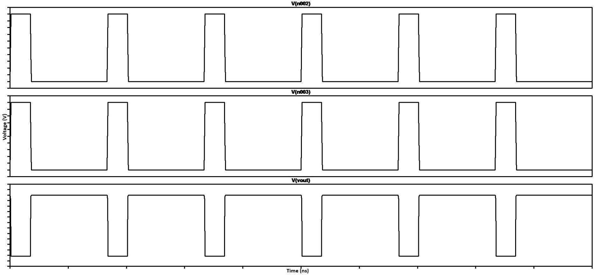 
Fig: Reference Waveform of Conventional NAND Gate 

# Scaled Nand Gate

## Reference Circuit

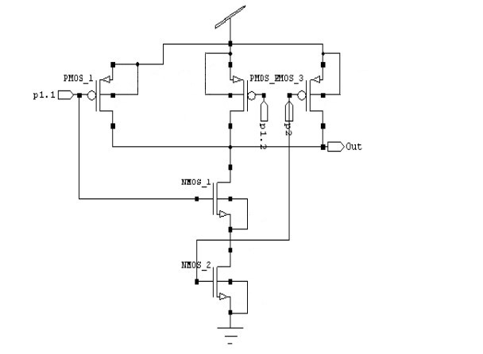 
Fig: Reference Circuit of Scaled NAND Gate 

## Design Explanation

In contrast to the Conventional NAND Gate Design, we can see in the reference circuit above, the 2-input Scaled CMOS NAND Gate is made by connecting three PMOS transistors in parallel which in turn are connected in series with the two NMOS transistors below, which again are in series connection with each other. The two input lines p1 and p2 are given in such a way that the p1.1 input line is given simultaneously to the gate of PMOS_1 and NMOS_1 transistors whereas the input line p2 is given simultaneously to the gate of PMOS_3 and NMOS_2 transistors. Also, p1.2 input line goes directly to the gate of pmos_2 transistor. The source of the PMOS transistors are given directly to the Vdd and the Vout terminal is observed to get our desired output.

Considering the truth table of NAND Gate shown above,

Case 1: When p1.1=p1.2=p2=0,both the NMOS are in OFF condition and PMOS are in ON condition. Therefore the output is connected to VDD and HIGH logic is present at the output terminal. 

Case 2: When p1.1=p1.2=0 and p2=1, the upper NMOS are in OFF condition and lower NMOS in ON condition. Left PMOS are in ON and right PMOS in OFF condition. Therefore the output is connected to VDD and HIGH logic is present at the output terminal. 

Case 3: When p1.1=p1.2=1 and p2=0, upper NMOS are in ON condition and lower NMOS in OFF condition. Left PMOS are in OFF and right PMOS in ON condition. Therefore the output is connected to VDD and HIGH logic is present at the output terminal. 

Case 4: When p1.1=p1.2=p2=1,both the NMOS are in ON condition and PMOS are in OFF condition. Therefore the output is connected to VDD and LOW logic is present at the output
terminal.

## Reference Waveform

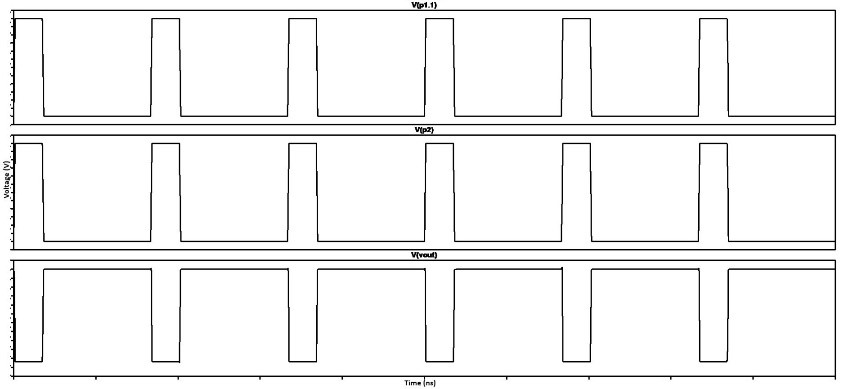 
Fig: Reference Waveform of Scaled NAND Gate 

# Tools Used
<b>• Synopsys Custom Compiler:</b> 
The Synopsys Custom Compiler™ design environment is a modern solution for full-custom analog, custom digital, and mixed-signal IC design. As the heart of the Synopsys Custom Design Platform, Custom Compiler provides design entry, simulation management and analysis, and custom layout editing features.
More information can be found here: <a href='https://www.synopsys.com/implementation-and-signoff/custom-design-platform/custom-compiler.html'>Synopsys Custom Compiler</a> 

<b>• Synopsys Primewave:</b> 
PrimeWave™ Design Environment is a comprehensive and flexible environment for simulation setup and analysis of analog, RF, mixed-signal design, custom-digital and memory designs within the Synopsys Custom Design Platform. The transient analysis of the above schematic was made possible because of this very tool. 
More information can be found here: <a href='https://www.synopsys.com/implementation-and-signoff/ams-simulation/primewave.html'>Synopsys PrimeWave Design Environment</a> 

<b>• Synopsys 28nm PDK:</b> 
The Schematic design and output analysis of the project was done entirely using the 28nm Process Design Kit by Synopsys.

# Circuit Design

## Conventional NAND Gate
### Schematic

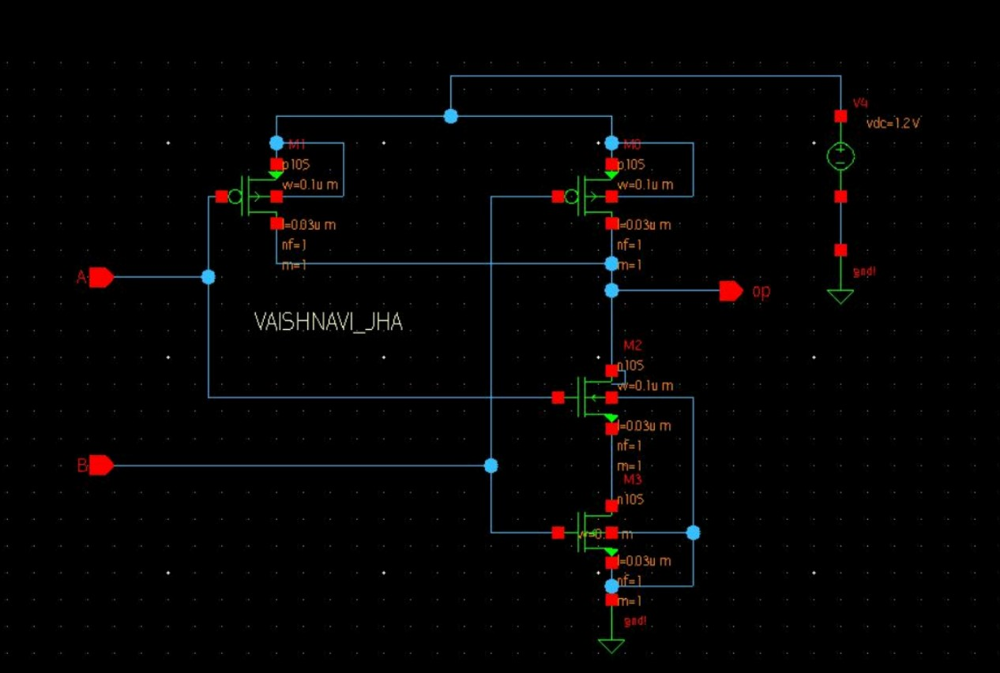 
Fig: Schematic 

### Symbol

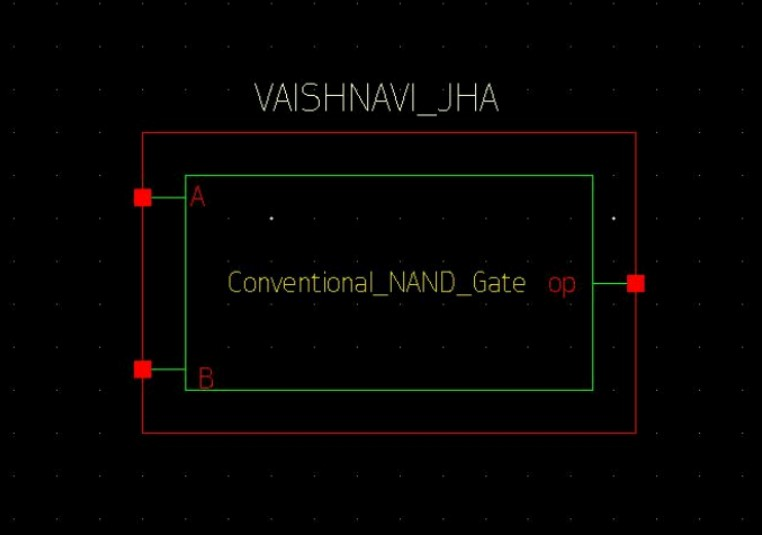 
Fig: Symbol

### Testbench

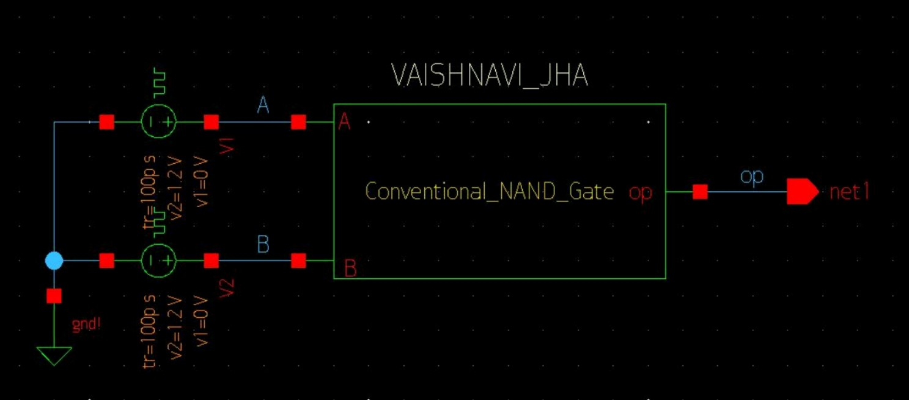 
Fig: Testbench 

## Scaled NAND Gate
### Schematic

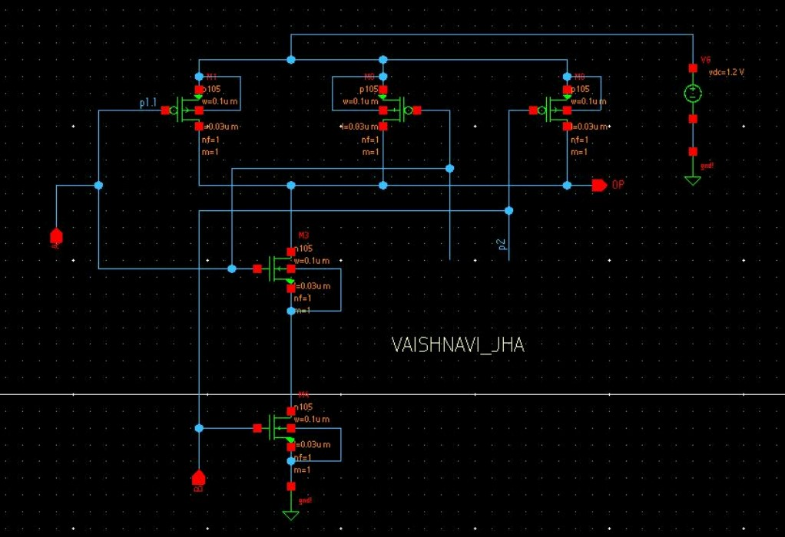 
Fig: Schematic

### Symbol

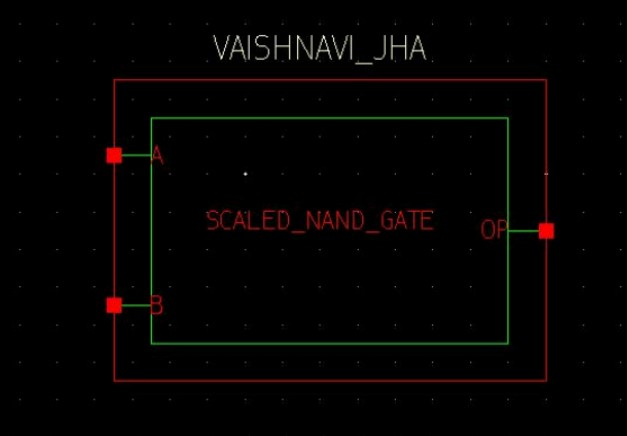 
Fig: Symbol

### Testbench

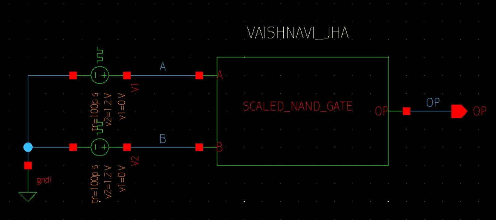 
Fig: Testbench 

# Simulation

The Simulation for the above circuits has been performed using the .trans analysis by importing the 28nm .lib file from the HSPICE directory in the PrimeWave Design Environment.

## Transient Analysis [as per Reference Waveform]

### Conventional NAND Gate

 

### Scaled NAND Gate

 

## Transient Analysis [as per Truth Table of NAND Gate]

### Conventional NAND Gate

 

### Scaled NAND Gate

 

# SPICE Netlist
## Conventional NAND Gate
To view the SPICE Netlist, kindly refer to: <a href='https://github.com/vaish2704/Scaled_CMOS_Nand/blob/main/Netlists/Conv_Nand.net'>Conv_Netlist</a> 

## Scaled NAND Gate
To view the SPICE Netlist, kindly refer to: <a href='https://github.com/vaish2704/Scaled_CMOS_Nand/blob/main/Netlists/Scaled_nand.net'>Scaled_Netlist</a> 

# Delay Comparison

 
Delay Table of NAND Gate

 
Delay Comparison Result of NAND Gate on 28nm CMOS Technology

# Conclusion
The design and analysis of the 2-Input Scaled CMOS NAND Gate was done successfully using the Synopsys tools and the delay comparison  was carried out with a Conventional 2-Input CMOS NAND Gate wherein it was noticed that the delay in the Conventional NAND Gate is approximately 7 times than that of the Scaled NAND Gate at the same CMOS scale of 28 nanometers.

# Author
• Vaishnavi Jha, B.Tech(ECE), SRM Institute of Science and Technology, Kattankulathur, Chennai-603203.

# Acknowledgements
• <a href='https://www.vlsisystemdesign.com/about-me/'>Kunal Ghosh</a>, Founder, VSD Corp. Pvt. Ltd. 
• <a href='https://iith.ac.in/'>IIT Hyderabad</a> 
• <a href='https://www.synopsys.com/'>Synopsys India</a> 

# References
[1] Mukesh Kumar, Dept. of ECE, SLIET, Longowal, “Analysis of CMOS Based NAND and NOR gates at 45 nm Technology”, International Journal of Electronics, Electrical and Computational System, ISSN 2348-117X Volume 6, Issue 4 April 2017 
[2] Poonam S. Wankhede, Asst Prof Mrs. Usha Jadhav, “Design and Analysis of NAND Gate Using 180nm and 90nm CMOS Technology”, IJSART - Volume 3 Issue 5 – MAY 2017

